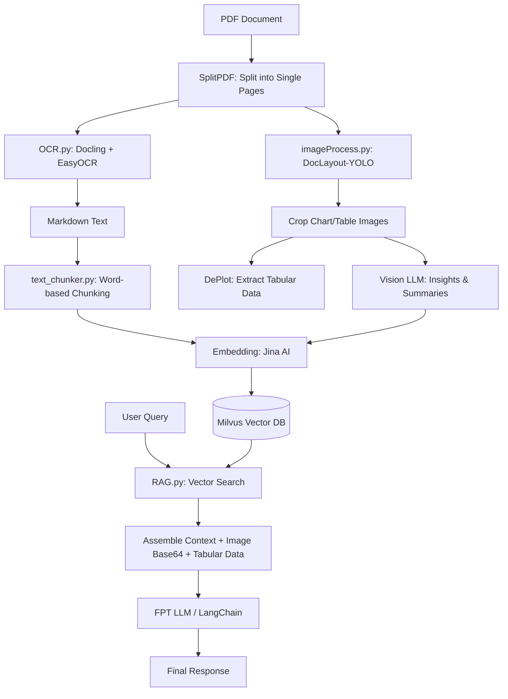

# Multimodal RAG Pipeline for PDF Document Analysis

A **Multimodal RAG (Retrieval-Augmented Generation)** system designed to process complex PDF documents (such as financial reports and banking statements) containing text, structured tables, and visual charts. The pipeline combines advanced OCR techniques, Vision AI for document layout parsing, chart-to-table extraction, dense vector embeddings, and multimodal LLM querying using Milvus Vector DB.

---

## Key Features

- **PDF Page Splitting**: Automatically splits multi-page PDF documents into individual single-page PDFs for parallel and accurate processing.
- **Multilingual OCR (Docling + EasyOCR)**: Extracts markdown text from scanned or digital PDF documents with Vietnamese and English language support.
- **Chart & Table Detection (DocLayout-YOLO)**: Utilizes `DocLayout-YOLO` (`YOLOv10`) to automatically detect and crop charts, figures, and table regions from PDF pages.
- **Chart-to-Table Extraction (Google DePlot)**: Uses `google/deplot` (Pix2Struct architecture) to convert chart images into raw underlying tabular data.
- **Vision LLM Analysis**: Generates structured chart descriptions, axis breakdowns, and key analytical insights using Vision LLM prompts (OpenAI API / FPT LLM).
- **Dense Vector Embeddings (Jina Embeddings v5)**: Converts text chunks and chart summaries into 1024-dimensional normalized dense vectors using `jina-embeddings-v5-text-small`.
- **Multimodal Vector Storage (Milvus Standalone)**: Manages vector database storage with a flexible schema capturing `text`, `chunk_type`, `image_path`, and `tabular_data`.
- **Multimodal RAG Query Engine**: Retrieves relevant context, combines text, tabular data, and base64-encoded image payloads, and prompts the LLM to generate precise answers.

---

## System Architecture



---

## Project Directory Structure

```text
tucode/
├── docker-compose.yml       # Milvus, ETCD, and MinIO Docker configuration
├── README.md                # Project documentation
├── .env                     # Environment variables and API keys
├── SplitPDF.py              # Basic PDF splitting script
├── chunking.py              # Word-based text chunking script
├── OCRDoclingEasyOCR.py     # OCR script using Docling + EasyOCR
├── embedding.py             # Jina Embeddings API client
├── milvusdb.py              # Milvus collection initialization (PyMilvus API)
├── storeEmbed.py            # Text embedding and ingestion script
├── RAG.py                   # Basic RAG query pipeline
│
└── Advanced/                # Advanced Multimodal RAG Pipeline
    ├── .env                 # Environment configuration for Advanced module
    ├── SplitPDF.py          # SplitPDF class implementation
    ├── text_chunker.py      # Flexible text chunking function
    ├── OCR.py               # Document OCR module returning Markdown format
    ├── imageProcess.py      # Vision processor: DocLayout-YOLO (Cropping) + DePlot (Chart-to-Table)
    ├── llm.py               # LLM integration (Vision and Text prompts)
    ├── embedding.py         # Jina Embeddings API client (1024-dim)
    ├── milvusdb.py          # MilvusClient with Multimodal Schema (Text, Chart, Image Path, Tabular Data)
    ├── embed_and_store.py   # End-to-End ingestion pipeline (Split -> OCR -> YOLO -> DePlot -> LLM -> Milvus)
    ├── test_deplot.py       # Standalone Google DePlot evaluation script
    ├── dropdb.py            # Utility script to drop Milvus collections
    └── RAG.py               # Multimodal RAG Engine: Retrieval, Base64 Image Loading & Prompt Assembly
```

---

## Prerequisites and Installation

### 1. System Requirements
- **Python**: >= 3.10
- **Docker & Docker Compose** (for running Milvus Vector Database)
- **GPU (Recommended)**: For faster execution of DocLayout-YOLO and Google DePlot inference.

### 2. Python Dependencies
Create a virtual environment and install the required packages:

```bash
pip install pypdf pymilvus docling easyocr transformers ultralytics doclayout-yolo huggingface-hub opencv-python PyMuPDF langchain-openai python-dotenv requests numpy
```

### 3. Environment Variables Configuration (`.env`)
Create a `.env` file in the root directory or inside the `Advanced/` directory with the following variables:

```env
# Milvus Config
MILVUS_HOST=127.0.0.1
MILVUS_PORT=19530
COLLECTION_NAME=vectorDatabase
DIMENSION=1024

# API Keys & Endpoints
JINA_API_KEY=jina_xxxxxxxxxxxxxxxxx
FPT_BASE_URL=https://...
FPT_MODEL=fpt-llm-model
FPT_API_KEY=xxxxxxxxxxxxxxxxx

# Directory Configs
IMAGE_DIR=D:\personal\tucode\Advanced\images
PAGES_DIR=D:\personal\tucode\Advanced\pages
RESULTS_FILE=D:\personal\tucode\Advanced\result.txt
MAX_PDF_TEXT_CHARS=300
```

---

## Step-by-Step Usage Guide

### Step 1: Start Milvus Database
Launch Milvus Standalone along with ETCD and MinIO using Docker Compose:

```bash
docker-compose up -d
```

Verify container status:
```bash
docker ps
```
Milvus will be accessible at port `19530`.

---

### Step 2: Document Processing and Data Ingestion Pipeline

Navigate to the `Advanced` directory and run `embed_and_store.py` to execute the full processing workflow:
1. Split input PDF into individual page files.
2. Run OCR to convert pages into Markdown text.
3. Detect and crop chart/table regions using YOLO.
4. Extract underlying tables with DePlot and generate chart insights with Vision LLM.
5. Generate embeddings and ingest vectors and metadata into Milvus.

```bash
cd Advanced
python embed_and_store.py
```

---

### Step 3: Run Multimodal RAG Query Engine

Execute `RAG.py` to ask questions against the ingested document repository:

```bash
python RAG.py
```

**Example Query:**
> *"How did the revenue for unleaded gasoline RON 95 differ between 2024 and 2025?"*

**Execution Flow:**
- Encodes query into a dense vector via Jina AI Embeddings.
- Searches top-k relevant text and chart entries in Milvus.
- Aggregates text contexts, tabular data (`tabular_data`), and attaches base64-encoded chart image payloads.
- Sends the assembled multimodal prompt to FPT LLM for response generation.

---

### Step 4: Standalone DePlot Testing (Optional)
To evaluate the Google DePlot chart-to-table extraction model independently:

```bash
python test_deplot.py path/to/chart_image.png
```

---

### Step 5: Reset Milvus Database Collection (Optional)
To drop the existing collection before re-ingesting new documents:

```bash
python dropdb.py
```

---

## Main Modules Breakdown

| Module / File | Description |
| :--- | :--- |
| [SplitPDF.py](file:///d:/personal/tucode/Advanced/SplitPDF.py) | Reads multi-page input PDF files and splits them into single-page PDF files using `pypdf`. |
| [OCR.py](file:///d:/personal/tucode/Advanced/OCR.py) | Configures `Docling` and `EasyOCR` with Vietnamese (`vi`) and English (`en`) support to output Markdown text. |
| [imageProcess.py](file:///d:/personal/tucode/Advanced/imageProcess.py) | Loads `DocLayout-YOLO` for chart detection/cropping and `google/deplot` for chart table extraction. |
| [llm.py](file:///d:/personal/tucode/Advanced/llm.py) | Initializes LangChain `ChatOpenAI` for FPT LLM API; provides `get_image_content` for Vision LLM prompt analysis. |
| [embedding.py](file:///d:/personal/tucode/Advanced/embedding.py) | API wrapper for Jina AI (`jina-embeddings-v5-text-small`) producing normalized 1024-dimensional embeddings. |
| [milvusdb.py](file:///d:/personal/tucode/Advanced/milvusdb.py) | Defines Milvus Schema (`id`, `chunk_type`, `vector`, `text`, `image_path`, `tabular_data`) and creates `COSINE` IVF_FLAT index. |
| [embed_and_store.py](file:///d:/personal/tucode/Advanced/embed_and_store.py) | Orchestrates the full end-to-end document processing and vector DB insertion pipeline. |
| [RAG.py](file:///d:/personal/tucode/Advanced/RAG.py) | Multimodal RAG Engine for similarity retrieval, base64 image encoding, prompt construction, and response synthesis. |

---

## Tech Stack

- **LLM & Vision Models**: FPT LLM (via LangChain ChatOpenAI interface), Google DePlot (`google/deplot`).
- **Layout Detection**: DocLayout-YOLO (`doclayout_yolo_docstructbench_imgsz1024.pt`).
- **OCR Engine**: Docling framework + EasyOCR.
- **Embedding Model**: Jina AI (`jina-embeddings-v5-text-small`).
- **Vector Database**: Milvus v2.3.11 (with ETCD & MinIO).
- **PDF & Image Libraries**: PyMuPDF (`fitz`), OpenCV (`cv2`), PIL, `pypdf`.
